
<h1 align="center">实验室开放管理系统</h1>

## 简介
实验室开放管理系统：角色分为管理员、用户；系统功能包括用户管理、实验室管理、申请管理、信息维护、实验室信息填写编辑、留言反馈、新闻资讯查看，支持实验室开放申请和审批。    --计算机毕业设计源码；毕设源码；java毕业设计源码

## 联系方式

<h3 align="center">获取完整代码与数据库文件 + 微信：deepguan QQ: 86050149 QQ群: 783742310</h3>

<h3 align="center">可帮忙远程部署 包运行成功！提供远程部署、修改代码、设计文档指导、代码讲解等服务！</h3>

## 功能介绍（完整见运行截图）
管理员：基本功能包括登录、注册和退出，主界面提供个人信息查看和修改、用户管理、实验室管理、申请管理及系统管理等功能模块。实验室管理界面允许管理员输入实验室信息、设置开放和关闭时间，并进行实验室列表的查询和使用申请处理。申请管理模块提供实验室使用申请的审核功能，支持批量操作和单个删除。用户管理部分允许查看和编辑用户信息，如姓名、账号、密码等。管理员还可以维护系统新闻资讯栏目和留言板，进行信息的发布与反馈管理。

用户：用户的基本操作包括登录、注册和退出。个人中心界面允许查看和修改个人信息如用户名、密码和联系方式。用户可以通过实验室信息页面获取实验室的详细信息，并通过申请管理模块提交实验室使用申请。用户还可以访问新闻资讯部分，查看最新信息和公告。在留言板模块中，用户可以查看、发布留言，并与其他用户进行信息交流。

## 运行截图
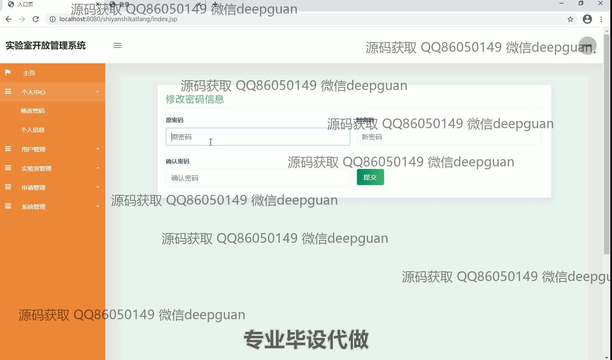
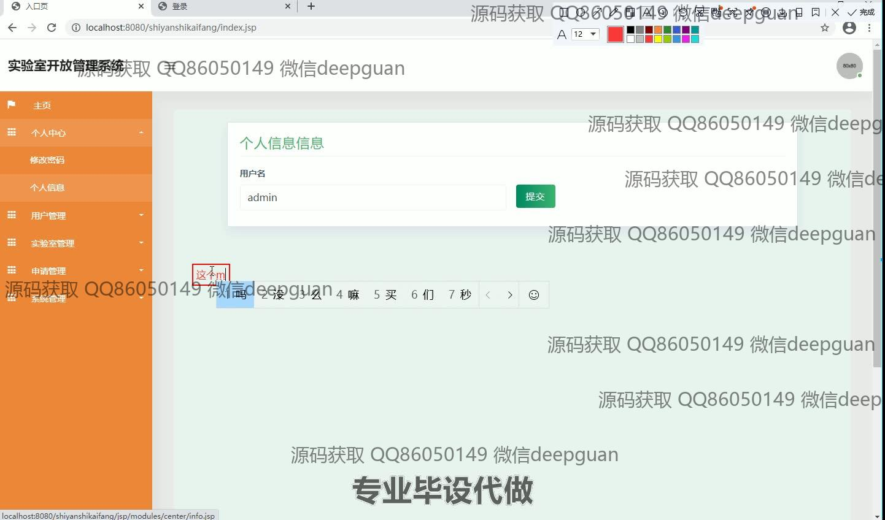
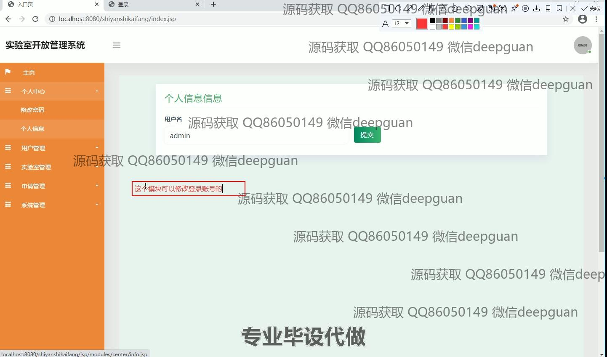
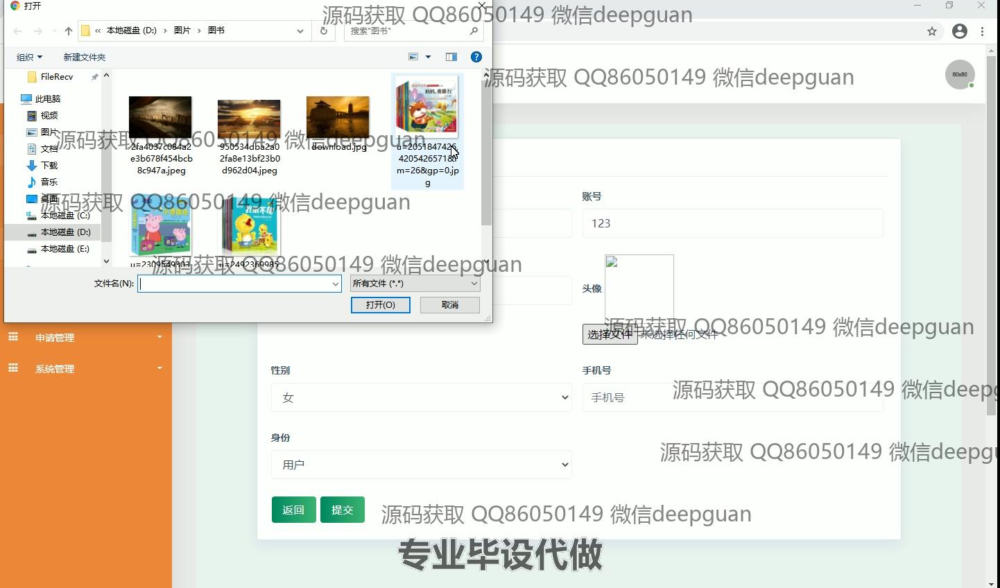
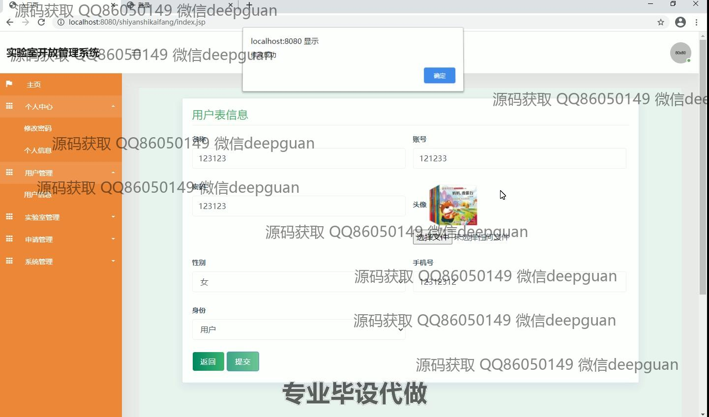
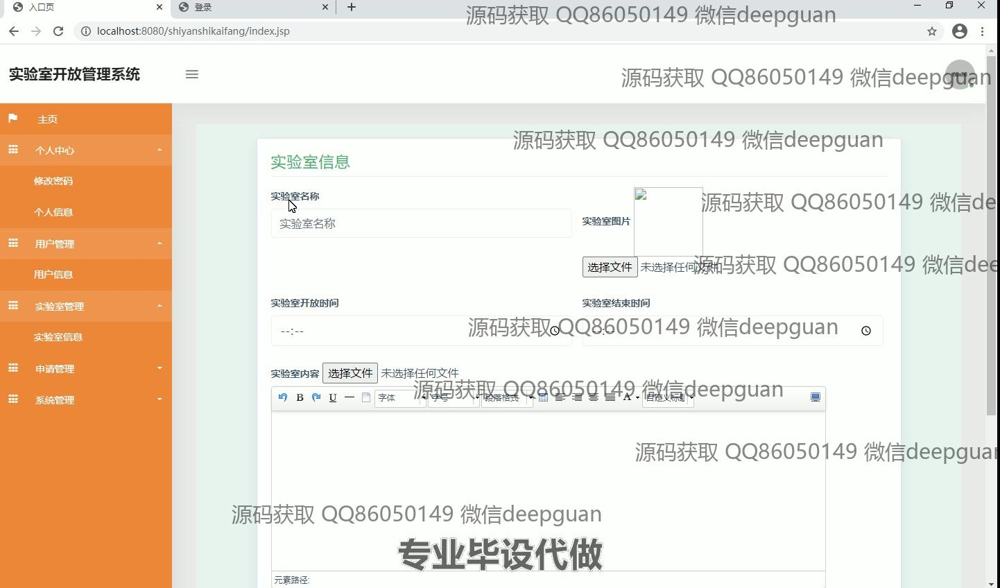
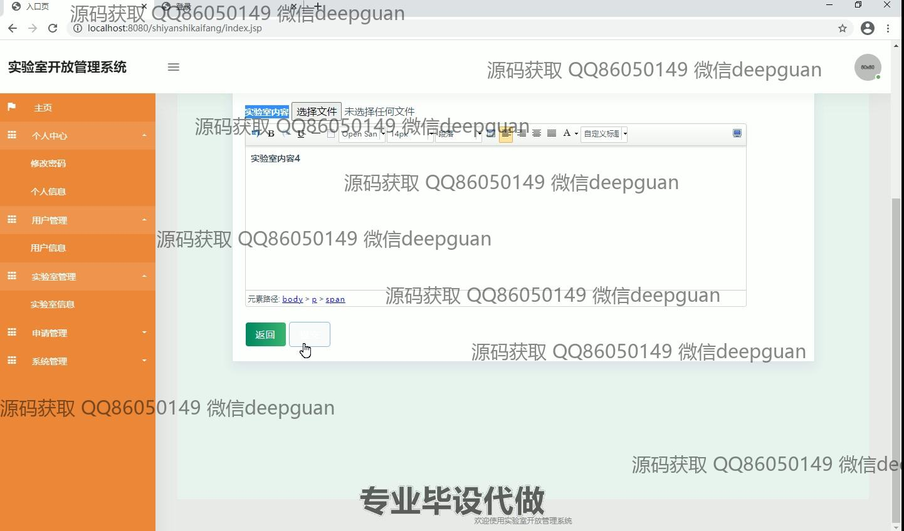

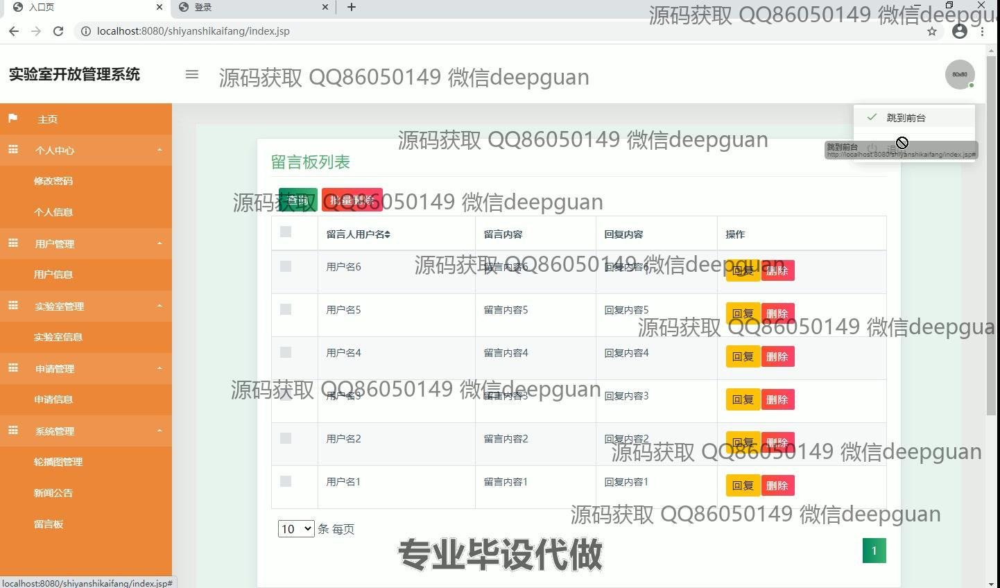
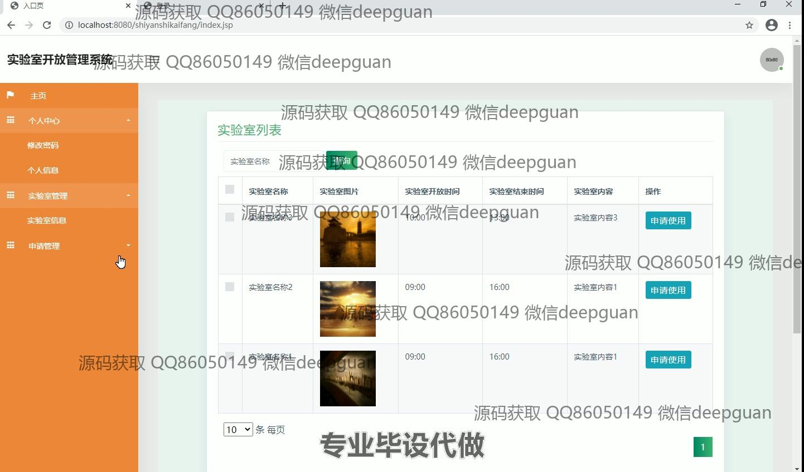
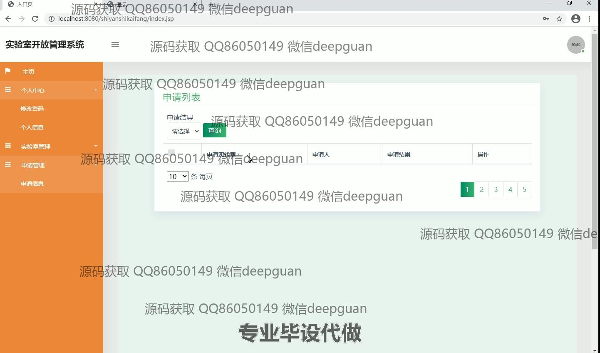
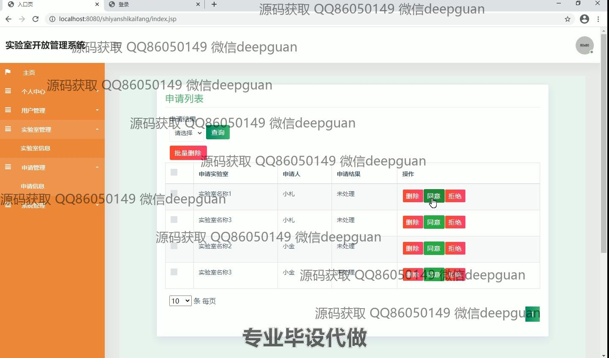
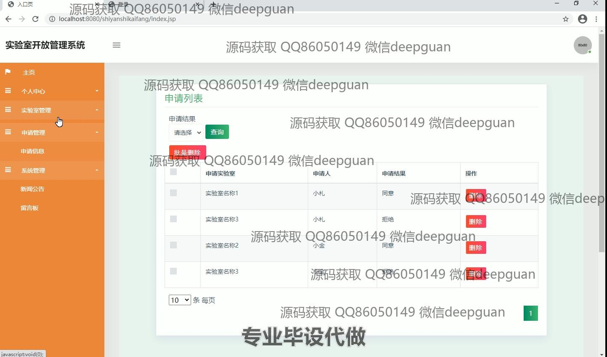
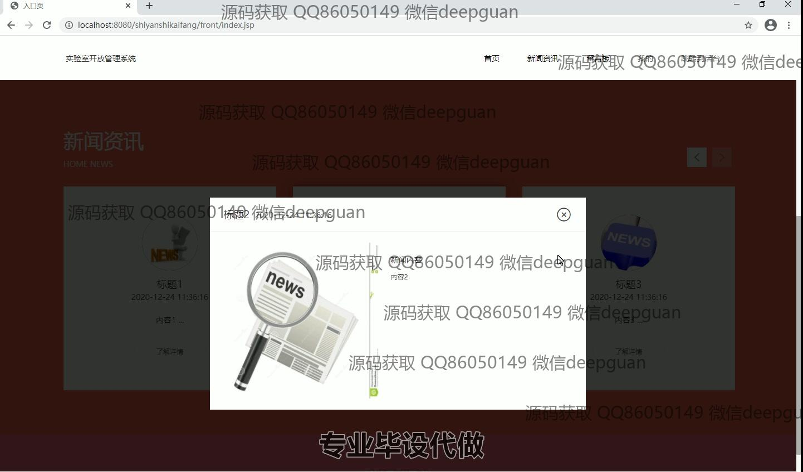
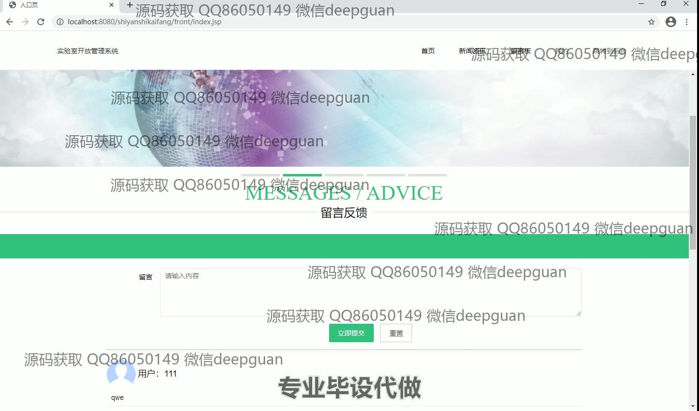

本代码来源于网络,仅供学习参考使用!

